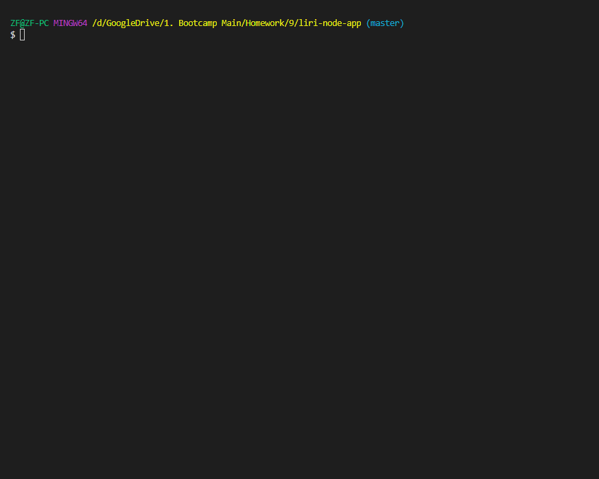
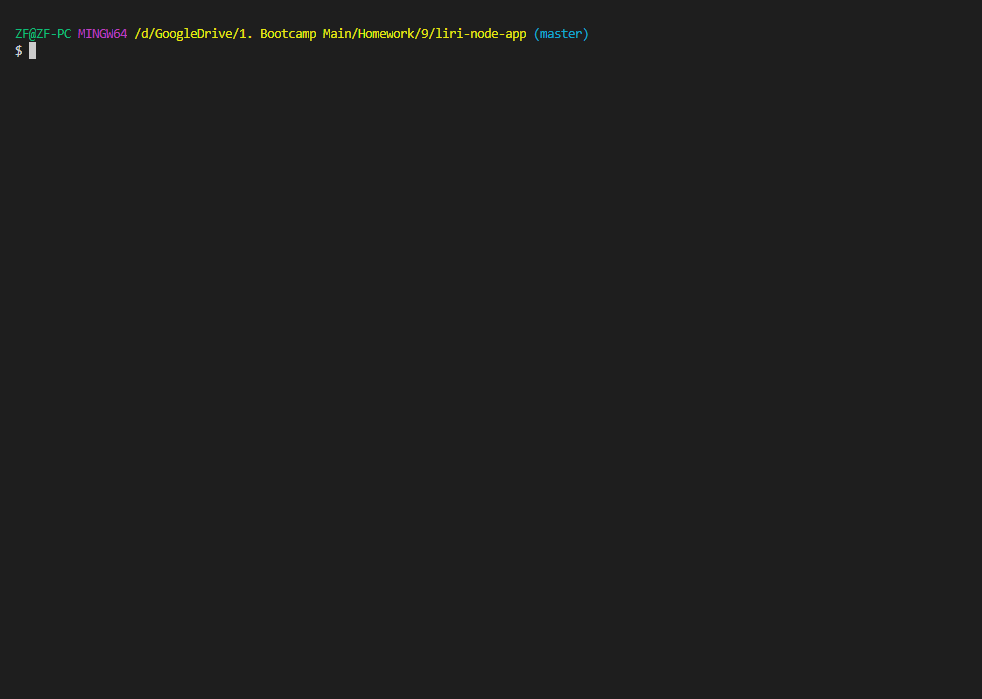
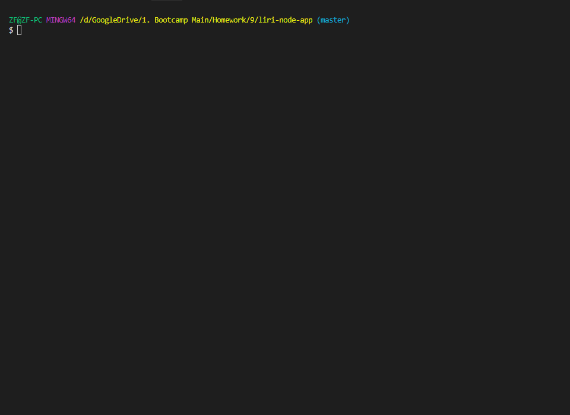
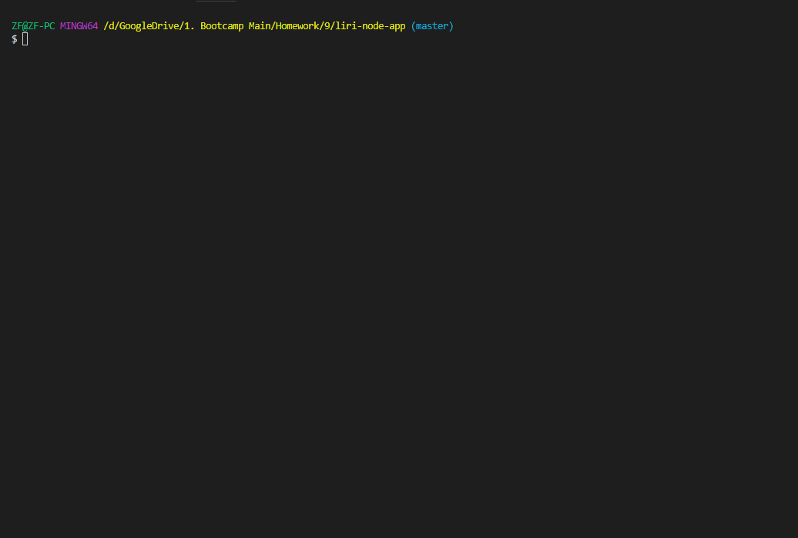

# liri-node-app

## Overview
LIRI is like iPhone's SIRI. However, while SIRI is a Speech Interpretation and Recognition Interface, LIRI is a Language Interpretation and Recognition Interface. LIRI will be a command line node app that takes in parameters and gives you back data.

## Instructions
To run this:
You will need to install node.js to your computer.
<br>
Install the required packages.
<br>
An env is required with the  keys to the API.
### To Use
Type in node liri in your terminal (make sure the current directory is the liri-node-app folder)
<br>
Use one of the following commands:

```terminal
node liri.js spotify-this-song example(song name)
node liri.js concert-this example(artist name)
node liri.js movie-this example(movie name)
node liri.js do-what-it-says
```
Insert your desired search term in place of example.
<br>
The command do-what-it-says pulls the information from the random.txt. Edit the information in that to get a different search result.

## Demonstration
#### Spotify This Song

#### Concert This

#### Movie This

#### Do What It Says



## Built With
* node.js
* fs from npm
* [Spotify API](https://developer.spotify.com/dashboard/login) - For music
* [Bands in Town API](https://www.artists.bandsintown.com/bandsintown-api) - For concert
* [OMDB API](http://www.omdbapi.com/) - For movie
* [Axios](https://www.npmjs.com/package/axios) - For HTTPS requests
* [Moment](https://www.npmjs.com/package/moment) - For parsing through date
* [dotenv](https://www.npmjs.com/package/dotenv) - For hiding API key
* [Node Spotify API](https://www.npmjs.com/package/node-spotify-api) - For spotify

## Author
* Kayleigh Starr