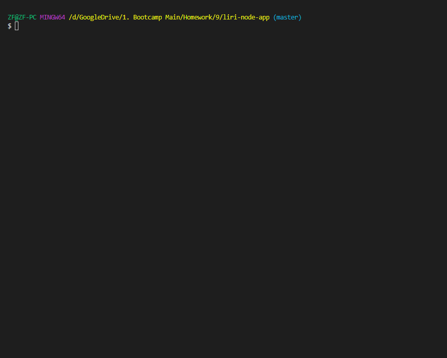
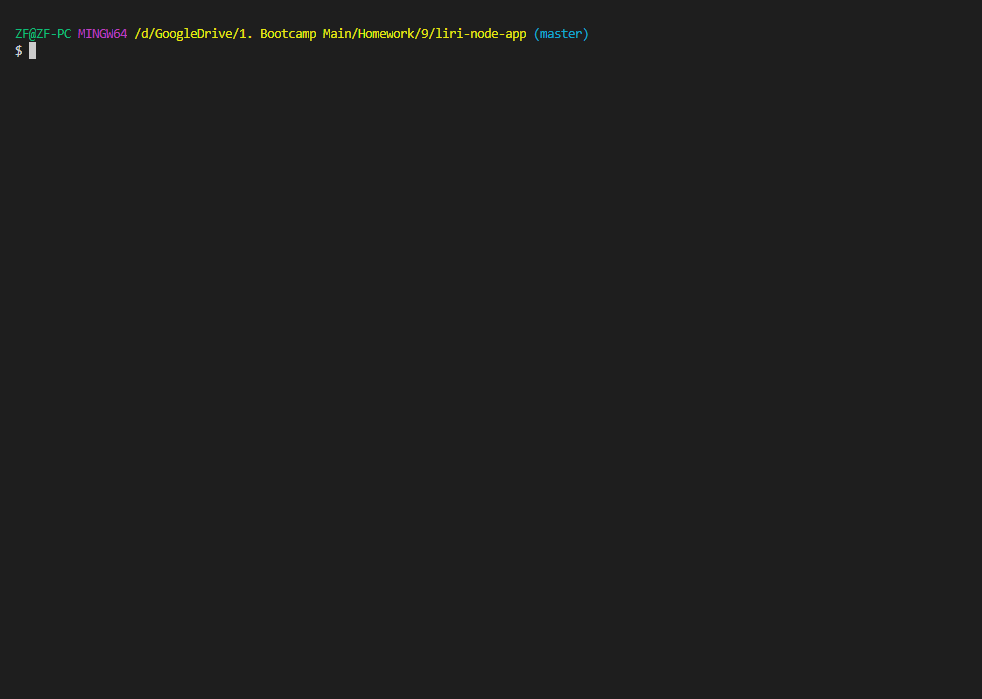
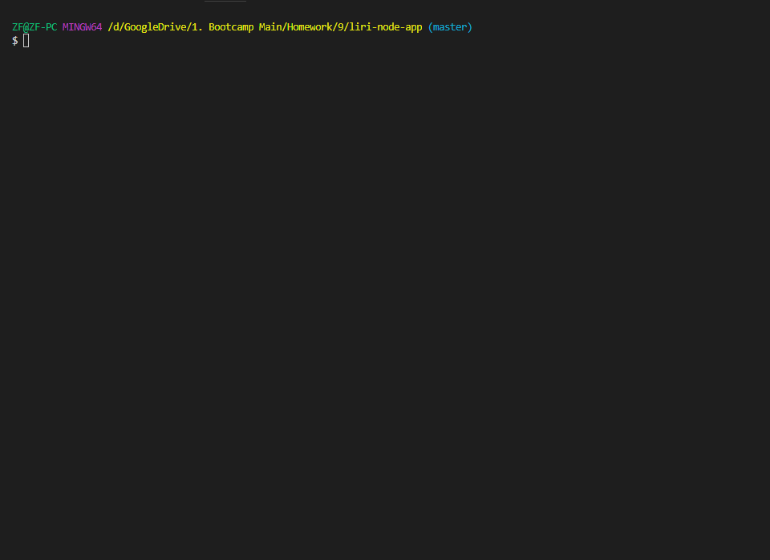
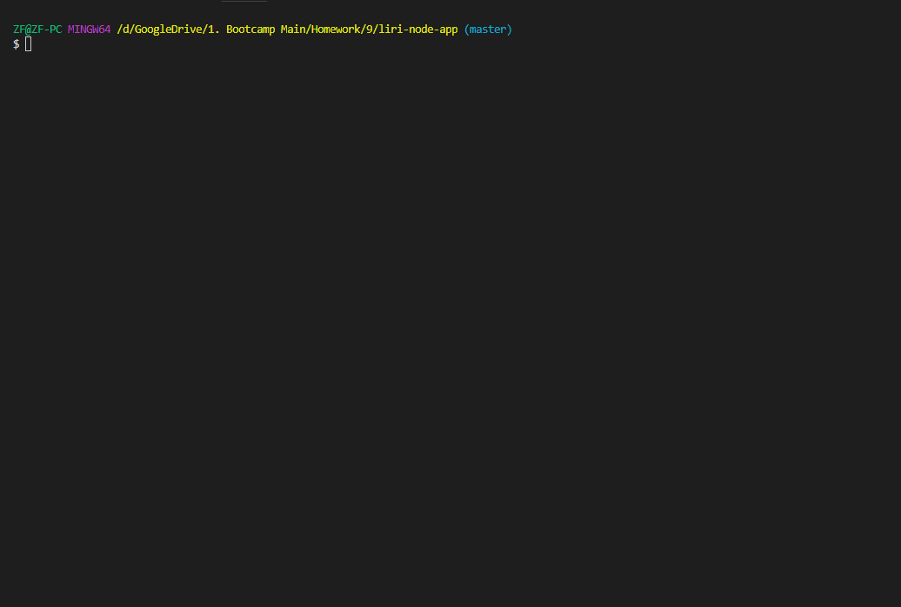

# liri-node-app

## Overview
LIRI is like iPhone's SIRI. However, while SIRI is a Speech Interpretation and Recognition Interface, LIRI is a Language Interpretation and Recognition Interface. LIRI will be a command line node app that takes in parameters and gives you back data.
 
The data is printed in the consol, as well as in the log.txt. 

## Instructions
To run this:
You will need to install node.js to your computer.
 
Install the required packages.
 
An env is required with the  keys to the API.
### To Use
Type in node liri in your terminal (make sure the current directory is the liri-node-app folder)
 
Use one of the following commands:

* `node liri.js spotify-this-song <song name>`
* `node liri.js concert-this <artist name>`
* `node liri.js movie-this <movie name>`
* `node liri.js do-what-it-says`

## Demonstration
### Spotify This Song

 * Shows the following information about the song.
    * Artist(s)
    * The song's name
    * A preview link of the song from Spotify
    * The album that the song is from
### Concert This

* Shows the following information about the song.
    * Name of the venue
    * Venue location
    * Date of the Event (use moment to format this as "MM/DD/YYYY")
### Movie This

  * Shows the following information.
    * Title of the movie.
    * Year the movie came out.
    * IMDB Rating of the movie.
    * Rotten Tomatoes Rating of the movie.
    * Country where the movie was produced.
    * Language of the movie.
    * Plot of the movie.
    * Actors in the movie.
### Do What It Says

  * Pulls the information from the random.txt. Edit the information in that to get a different search result.

## Built With
* node.js
* fs from npm
* [Spotify API](https://developer.spotify.com/dashboard/login) - For music
* [Bands in Town API](https://www.artists.bandsintown.com/bandsintown-api) - For concert
* [OMDB API](http://www.omdbapi.com/) - For movie
* [Axios](https://www.npmjs.com/package/axios) - For HTTPS requests
* [Moment](https://www.npmjs.com/package/moment) - For parsing through date
* [dotenv](https://www.npmjs.com/package/dotenv) - For hiding API key
* [Node Spotify API](https://www.npmjs.com/package/node-spotify-api) - For spotify

## Author
* Kayleigh Starr